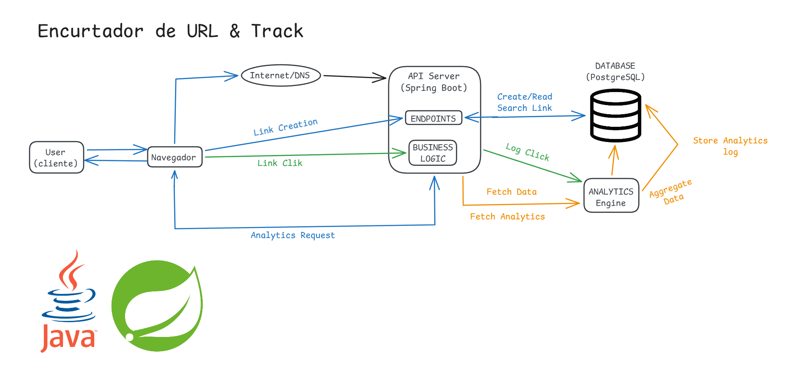

# 🌐 Shortify & Track - Encurtador de URLs com Analytics Real-Time

O Shortify & Track é uma API REST desenvolvida em Java e Spring Boot projetada para encurtar URLs longas e rastrear métricas de acesso em tempo real. O grande diferencial do sistema é o foco em performance: o redirecionamento do usuário ocorre de forma instantânea, enquanto a coleta e agregação de dados do Analytics acontecem em segundo plano (assíncrono), evitando gargalos no banco de dados.

## 🏗️ Arquitetura do Sistema



### Pontos Chave da Engenharia do Projeto:

*   **Processamento Assíncrono (`@Async`)**: O registro de cliques e análise do User-Agent roda em uma thread dedicada em background, liberando a requisição principal para redirecionar o usuário imediatamente.
*   **Otimização de Banco de Dados**: Indexação estratégica (`INDEX`) no campo `short_code` para garantir buscas em tempo constante, mesmo com milhões de links criados.
*   **Consultas Agregadas nativas (JPQL)**: O dashboard consome dados agrupados diretamente no PostgreSQL (`GROUP BY`), evitando sobrecarga de memória na aplicação Java.

## 🛠️ Tecnologias Utilizadas

*   **Linguagem**: Java 21
*   **Framework**: Spring Boot 3.5
*   **Persistência**: Spring Data JPA / Hibernate
*   **Banco de Dados**: PostgreSQL
*   **Validação**: Jakarta Bean Validation
*   **Testes**: JUnit 5 & Mockito

## 📁 Estrutura do Projeto

```
├── src/main/java/com/shorter/api/
│   ├── config/      # Configurações de Threads para o @Async e CORS
│   ├── controller/  # Endpoints HTTP da API (Portas de entrada)
│   ├── dto/         # Objetos de transferência de dados (Data Transfer Objects)
│   ├── entity/      # Entidades mapeadas para o banco de dados (JPA)
│   ├── repository/  # Interfaces de comunicação com o PostgreSQL
│   └── service/     # Camada com as regras de negócio e lógica assíncrona
```

## 🚀 Endpoints Principais (API)

### Encurtar uma URL

*   **Rota**: `POST /api/urls`
*   **Payload (JSON)**:
    ```json
    {
      "url": "https://github.com/Pereira-gu"
    }
    ```
*   **Resposta (201 Created)**:
    ```json
    {
      "shortCode": "aB8z9X",
      "originalUrl": "https://github.com/Pereira-gu"
    }
    ```

### Redirecionamento & Captura de Analytics

*   **Rota**: `GET /{shortCode}` (ex: `GET /aB8z9X`)
*   **Resposta (302 Found)**: Redireciona instantaneamente para a URL original enquanto processa as métricas de dispositivo e navegador em background.

### Dashboard de Analytics

*   **Rota**: `GET /api/urls/{shortCode}/analytics`
*   **Resposta (200 OK)**:
    ```json
    {
      "totalClicks": 125,
      "clicksByBrowser": [
        { "browser": "Chrome", "count": 90 },
        { "browser": "Firefox", "count": 35 }
      ],
      "clicksByDevice": [
        { "device": "Desktop", "count": 100 },
        { "device": "Mobile", "count": 25 }
      ]
    }
    ```

## 🧪 Como Rodar e Testar

1.  **Clone o repositório**:
    ```bash
    git clone https://github.com/Pereira-gu/URL_Shorter.git
    ```
2.  **Configure as credenciais do seu PostgreSQL** no arquivo `src/main/resources/application.properties`.
3.  **Execute o projeto usando o Maven Wrapper**:
    ```bash
    ./mvnw spring-boot:run
    ```
4.  **Para rodar a suíte de testes automatizados**:
    ```bash
    ./mvnw test
    ```